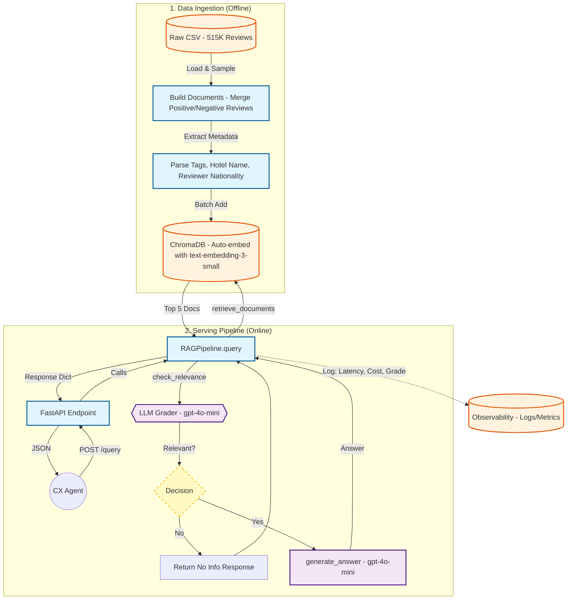

# Design Document: Review Intelligence Assistant

## 1. Executive Summary
The **Review Intelligence Assistant** is a Retrieval-Augmented Generation (RAG) system designed to allow Customer Experience (CX) agents to query 515K+ hotel reviews using natural language. The system prioritizes **trustworthiness** over creativity, ensuring every answer is grounded in specific, retrievable guest feedback.

## 2. System Architecture

The system follows an **Advanced RAG** architecture with a "Self-Correction" loop to prevent hallucinations.

### 2.1 High-Level Data Flow
1.  **Ingestion (Offline):**
    * **Input:** Raw CSV (`Hotel_Reviews.csv`).
    * **Processing:** Merges `Positive_Review` and `Negative_Review` into a single semantic chunk.
    * **Metadata Extraction:** Parses `Tags`, `Hotel_Name`, and `City` to enable **Hybrid Search** (Vector + Metadata Filtering).
    * **Embedding:** `text-embedding-3-small` (1536d) stored in **ChromaDB**.

2.  **Serving (Online):**
    * **Query Analysis:** User input is parsed; optional filters (e.g., "Hotel X") are extracted.
    * **Hybrid Retrieval:** Performs a vector search constrained by metadata filters (e.g., `WHERE hotel_name = 'The Ritz'`).
    * **Self-Correction (The "Gatekeeper"):** A dedicated LLM call grades the retrieved context.
        * *Pass:* Context is sent to the Generator.
        * *Fail:* System returns a "No Information" fallback to prevent hallucination.
    * **Generation:** `gpt-4o-mini` synthesizes the answer, citing sources.

### 2.2 Component Diagram

[User] -> [FastAPI Service]
       -> [Orchestrator]
          -> 1. [ChromaDB] (Hybrid Search)
          -> 2. [LLM Grader] (Relevance Check)
          -> 3. [LLM Generator] (Final Answer)

---

## 3. Key Architectural Decisions & Tradeoffs

| Decision | Alternative | Why this choice? |
| :--- | :--- | :--- |
| **RAG Architecture** | Fine-Tuning | **Traceability.** Reviews change constantly. RAG allows instant updates without retraining and reduces hallucinations by grounding answers in retrieved context. |
| **Hybrid Search** | Vector Only | **Precision.** Vector search struggles with exact keyword constraints (e.g., specific hotel names). Metadata filtering ensures we only search relevant reviews. |
| **Self-Correction Loop** | Linear Pipeline | **Safety.** A "Grader" step increases latency slightly but critically prevents "unsupported claims" by blocking irrelevant context before generation. |
| **Model: gpt-4o-mini** | Llama 3 (Local) | **Reliability & Cost.** `4o-mini` offers the best balance of reasoning capability and cost for this prototype constraint. |

---

## 4. Observability & Monitoring Plan

### 4.1 Metrics (Datadog / Prometheus)
* **P95 Latency:** Tracking the end-to-end response time.
    * *Target:* < 2.0s for prototype; < 500ms for retrieval.
* **Retrieval Failure Rate:** The % of queries where the "Self-Correction" grader returns `False`.
    * *Signal:* A spike indicates data drift or that the embedding model is failing to capture user intent.
* **Cost Per Query:** Tracking token usage (Input/Output) to manage `4o-mini` budget.

### 4.2 Logging
* **Structured Logs:** JSON logs capturing `request_id`, `query_text`, `retrieved_doc_ids`, `grader_decision`, and `final_latency`.

### 4.3 Quality Evaluation (Golden Set)
* **Automated Regression Testing:** An "LLM-as-a-Judge" pipeline runs on every PR.
* **Golden Dataset:** 20 human-verified Q&A pairs (e.g., "Is the wifi good at Hotel X?" -> "Yes").
* **Metric:** **Faithfulness Score** (Does the answer come *only* from the context?) and **Answer Relevance** (Does it answer the user?).

---

## 5. Failure Modes & Mitigations

1.  **LLM Service Outage:**
    * *Mitigation:* Circuit breaker pattern. If OpenAI API times out, fallback to a cached response or a graceful "Service Busy" error.
2.  **Empty Retrieval:**
    * *Mitigation:* If Vector DB finds no matches > 0.7 similarity, return "I don't have enough data on that topic" immediately, skipping the LLM generation cost.
3.  **Prompt Injection:**
    * *Mitigation:* Input validation (Pydantic) and a rigorous System Prompt that explicitly forbids role-playing outside the "Hotel Assistant" persona.

---

## 6. Scaling Strategy (Bonus Question)

Scaling to **50M documents** introduces specific challenges in **Indexing** and **Infrastructure Costs**.

### 6.1 Indexing Strategy: HNSW + Quantization
* **Challenge:** 50M vectors (1536d) require ~300GB of RAM using `float32`. This is cost-prohibitive.
* **Solution:** Move to **HNSW (Hierarchical Navigable Small World)** with **Product Quantization (PQ)** or **Scalar Quantization (SQ8)**.
    * *Impact:* Reduces memory footprint by **4x-8x** (down to ~40GB) with negligible loss in recall.
    * *Latency:* HNSW ensures $O(\log N)$ search complexity, maintaining sub-second retrieval.

### 6.2 Data Partitioning (Sharding)
* **Challenge:** A single node cannot handle the write throughput or CPU load of 50M docs.
* **Solution:** **Random Sharding** (Review-based).
    * *Why not Hotel-based?* "Hot Partition" risk. A popular hotel (e.g., "The Ritz") would overload one shard.
    * *Implementation:* Distribute reviews randomly across 3-5 nodes. The query aggregator performs a "Scatter-Gather" search across all shards in parallel.

### 6.3 Caching Strategy
* **Semantic Cache (Redis):** Cache the *embedding* of common queries.
    * If a user asks "Breakfast at the Hilton?", we check the cache first.
    * *Benefit:* Eliminates LLM and Vector DB latency for the top 20% of repeated queries.

### 6.4 Streaming Ingestion
* **Migration:** Move from batch scripts (`ingest.py`) to a **Kafka-based** streaming pipeline.
    * New reviews are pushed to a Kafka topic $\rightarrow$ Embedded by a worker service $\rightarrow$ Upserted to the Vector DB in near real-time.