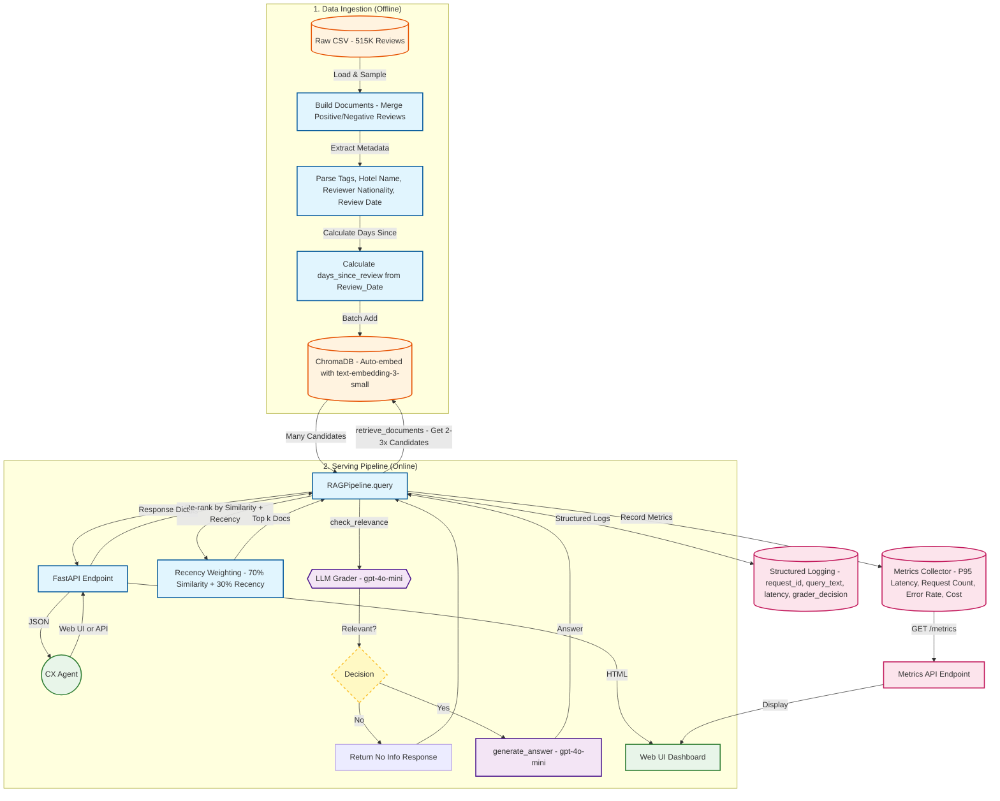

# Design Document: Review Intelligence Assistant

## 1. Executive Summary
The **Review Intelligence Assistant** is a Retrieval-Augmented Generation (RAG) system designed to allow Customer Experience (CX) agents to query 515K+ hotel reviews using natural language. The system prioritizes **trustworthiness** over creativity, ensuring every answer is grounded in specific, retrievable guest feedback.

## 2. System Architecture

The system follows an **Advanced RAG** architecture with a "Self-Correction" loop to prevent hallucinations.

### 2.1 High-Level Data Flow
1.  **Ingestion (Offline):**
    * **Input:** Raw CSV (`Hotel_Reviews.csv`).
    * **Processing:** Merges `Positive_Review` and `Negative_Review` into a single semantic chunk.
    * **Metadata Extraction:** Parses `Tags`, `Hotel_Name`, `Reviewer_Nationality`, and `Review_Date` to enable **Hybrid Search** (Vector + Metadata Filtering) and **Recency Weighting**. Calculates `days_since_review` dynamically from `Review_Date` (relative to today).
    * **Embedding:** `text-embedding-3-small` (1536d) stored in **ChromaDB**.

2.  **Serving (Online):**
    * **Query Analysis:** User input is parsed via FastAPI; optional filters (e.g., "Hotel X") are extracted.
    * **Hybrid Retrieval with Recency Weighting:** 
        * Retrieves 2-3x more candidates than requested (more when filtering by hotel)
        * Performs vector search constrained by metadata filters
        * Re-ranks results by combining semantic similarity (70% default) with recency score (30% default)
        * Recency scoring uses exponential decay: 0-30 days = 1.0, 30-90 = 0.8, 90-180 = 0.6, 180-365 = 0.4, >365 = 0.2
        * Returns top k documents after re-ranking
    * **Self-Correction (The "Gatekeeper"):** A dedicated LLM call grades the retrieved context.
        * *Pass:* Context is sent to the Generator.
        * *Fail:* System returns a "No Information" fallback to prevent hallucination.
    * **Generation:** `gpt-4o-mini` synthesizes the answer, prioritizing information from recent reviews when available.
    * **Metrics & Logging:** All requests are tracked with structured logging and metrics collection (latency, token usage, errors).

### 2.2 Component Diagram

[User/Web UI] -> [FastAPI Service]
              -> [RAGPipeline]
                 -> 1. [ChromaDB] (Hybrid Search with Recency Weighting)
                 -> 2. [LLM Grader] (Relevance Check)
                 -> 3. [LLM Generator] (Final Answer)
              -> [Metrics Collector] (P95 Latency, Cost, Error Rate)
              -> [Structured Logging] (Request Tracking)

---

## 3. Key Architectural Decisions & Tradeoffs

| Decision | Alternative | Why this choice? |
| :--- | :--- | :--- |
| **RAG Architecture** | Fine-Tuning | **Traceability.** Reviews change constantly. RAG allows instant updates without retraining and reduces hallucinations by grounding answers in retrieved context. |
| **Hybrid Search** | Vector Only | **Precision.** Vector search struggles with exact keyword constraints (e.g., specific hotel names). Metadata filtering ensures we only search relevant reviews. |
| **Self-Correction Loop** | Linear Pipeline | **Safety.** A "Grader" step increases latency slightly but critically prevents "unsupported claims" by blocking irrelevant context before generation. |
| **Model: gpt-4o-mini** | Llama 3 (Local) | **Reliability & Cost.** `4o-mini` offers the best balance of reasoning capability and cost for this prototype constraint. |
| **Recency Weighting** | Semantic Only | **Temporal Relevance.** Hotel conditions change over time. Newer reviews (0-30 days) are weighted 1.0x, older reviews (>365 days) are weighted 0.2x, ensuring answers reflect current hotel state. |
| **Web UI** | API Only | **Usability.** Provides an intuitive interface for CX agents to query reviews without needing API knowledge. Includes real-time metrics dashboard. |
| **In-Memory Metrics** | External Service | **Simplicity.** For prototype, in-memory metrics are sufficient. Can migrate to Prometheus/Datadog for production. |

---

## 4. Observability & Monitoring Plan

### 4.1 Metrics (Implemented)
* **Implementation:** In-memory metrics collector (`src/metrics.py`) with global singleton pattern.
* **P95 Latency:** Tracking the end-to-end response time from all requests.
    * *Target:* < 2.0s for prototype; < 500ms for retrieval.
    * *Calculation:* Maintains last 1000 latency samples, calculates 95th percentile.
* **Retrieval Failure Rate:** The % of queries where the "Self-Correction" grader returns `False` or no documents are found.
    * *Signal:* A spike indicates data drift or that the embedding model is failing to capture user intent.
* **Cost Per Query:** Tracking token usage (Input/Output) to manage `4o-mini` budget.
    * *Pricing Assumption:* $0.15 per 1M input tokens, $0.60 per 1M output tokens (gpt-4o-mini).
* **Access:** 
    * Web Dashboard: `http://localhost:8000/metrics-page`
    * API Endpoint: `GET /metrics` returns JSON summary
* **Note:** Metrics are in-memory and reset on server restart.

### 4.2 Logging (Implemented)
* **Implementation:** Structured logging via `src/logging_config.py` with custom formatter.
* **Format:** Pipe-delimited key-value pairs output to stdout (terminal/console).
* **Fields Captured:** 
    * `timestamp`, `level`, `message` (always present)
    * `request_id` (unique UUID per request)
    * `query_text`, `hotel_filter` (query details)
    * `retrieved_doc_count`, `grader_decision` (retrieval results)
    * `final_latency` (performance data)
    * `error` (if errors occur)
* **Log Levels:** INFO for normal operations, WARNING for recoverable issues, ERROR for failures.
* **Third-party Noise:** ChromaDB and httpx logs are suppressed to WARNING level.

### 4.3 Quality Evaluation (Golden Set)
* **Automated Regression Testing:** An "LLM-as-a-Judge" pipeline runs on every PR.
* **Golden Dataset:** 20 human-verified Q&A pairs (e.g., "Is the wifi good at Hotel X?" -> "Yes").
* **Metric:** **Faithfulness Score** (Does the answer come *only* from the context?) and **Answer Relevance** (Does it answer the user?).

---

## 5. Failure Modes & Mitigations

1.  **LLM Service Outage:**
    * *Mitigation:* Circuit breaker pattern. If OpenAI API times out, fallback to a cached response or a graceful "Service Busy" error.
2.  **Empty Retrieval:**
    * *Mitigation:* If Vector DB finds no matches > 0.7 similarity, return "I don't have enough data on that topic" immediately, skipping the LLM generation cost.
3.  **Prompt Injection:**
    * *Mitigation:* Input validation (Pydantic) and a rigorous System Prompt that explicitly forbids role-playing outside the "Hotel Assistant" persona.

---

## 6. Scaling Strategy (Bonus Question)

Scaling to **50M documents** introduces specific challenges in **Indexing** and **Infrastructure Costs**.

### 6.1 Data Partitioning (Sharding)
* **Challenge:** A single node cannot handle the write throughput or CPU load of 50M docs.
* **Solution:** **Random Sharding** (Review-based).
    * *Why not Hotel-based?* "Hot Partition" risk. A popular hotel (e.g., "The Ritz") would overload one shard.
    * *Implementation:* Distribute reviews randomly across 3-5 nodes. The query aggregator performs a "Scatter-Gather" search across all shards in parallel.

### 6.2 Caching Strategy
* **Semantic Cache (Redis):** Cache the *embedding* of common queries.
    * If a user asks "Breakfast at the Hilton?", we check the cache first.
    * *Benefit:* Eliminates LLM and Vector DB latency for the top 20% of repeated queries.

### 6.3 Streaming Ingestion
* **Migration:** Move from batch scripts (`ingest.py`) to a **Kafka-based** streaming pipeline.
    * New reviews are pushed to a Kafka topic $\rightarrow$ Embedded by a worker service $\rightarrow$ Upserted to the Vector DB in near real-time.